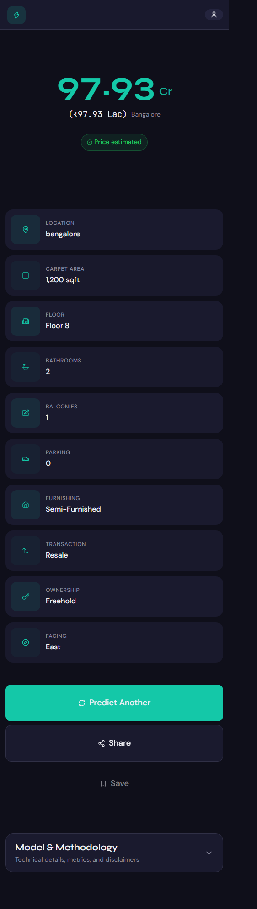

# House Price Prediction — End-to-End ML Web App

A complete machine learning product that predicts house prices in India, from raw data to deployed web app.

## Architecture

```
┌─────────────┐     ┌─────────────┐     ┌─────────────┐
│   Notebook  │────▶│  FastAPI    │────▶│   React     │
│  (Training) │     │  (Backend)  │     │  (Frontend) │
└─────────────┘     └─────────────┘     └─────────────┘
       │                   │                   │
       ▼                   ▼                   ▼
   .pkl model          REST API            Web Form
   locations.json       /predict            + Result
```

## Tech Stack

| Layer | Technology |
|-------|------------|
| Data Science | Python 3.11+, pandas, scikit-learn, Jupyter |
| Backend | FastAPI, uvicorn, pydantic, joblib |
| Frontend | React 18, TypeScript, Vite, Tailwind CSS |
| Deployment | Docker, GitHub |

## Project Structure

```
house-price-app/
├── notebooks/
│   ├── data/house_prices.csv      # Raw dataset (not committed)
│   ├── house_price_model.ipynb    # Training notebook
│   ├── house_price.pkl            # Trained pipeline (not committed)
│   ├── locations.json             # Allowed locations
│   └── model_metrics.json         # Model performance
├── backend/
│   ├── app/
│   │   ├── main.py                # FastAPI app
│   │   ├── core/config.py         # Settings
│   │   ├── api/routes/prediction.py # API endpoints
│   │   ├── schemas/prediction.py  # Pydantic models
│   │   ├── services/
│   │   │   ├── preprocessing.py   # Request → DataFrame
│   │   │   └── inference.py       # Model loading & prediction
│   │   └── utils/logging_config.py
│   ├── models/
│   │   ├── house_price.pkl        # Copied from notebook
│   │   └── locations.json         # Copied from notebook
│   ├── tests/test_prediction.py   # API tests
│   ├── requirements.txt
│   ├── Dockerfile
│   └── .env.example
├── frontend/
│   ├── src/
│   │   ├── api/predictionClient.ts
│   │   ├── components/PredictionForm.tsx
│   │   ├── pages/HomePage.tsx, ResultPage.tsx
│   │   └── types/prediction.ts
│   ├── package.json
│   ├── tailwind.config.js
│   └── .env.example
├── .gitignore
└── README.md
```

## Dataset

**Source:** [House Price by Juhi Bhojani](https://www.kaggle.com/datasets/juhibhojani/house-price) on Kaggle
- ~187,000 property listings from India
- Features: location, carpet area, floor, bathrooms, balconies, furnishing, transaction type, ownership, facing

## Setup Instructions

### Prerequisites
- Python 3.11+
- Node.js 18+
- Git
- Kaggle account (for dataset)

### 1. Clone and Setup Backend

```bash
git clone https://github.com/<your-username>/house-price-app.git
cd house-price-app/backend

# Create virtual environment
python -m venv .venv
.venv\Scripts\activate  # Windows
# source .venv/bin/activate  # macOS/Linux

# Install dependencies
pip install -r requirements.txt

# Copy model files (run notebook first if not present)
cp ../notebooks/house_price.pkl models/
cp ../notebooks/locations.json models/

# Copy env file
cp .env.example .env

# Run backend
uvicorn app.main:app --reload
# API at http://localhost:8000
# Docs at http://localhost:8000/docs
```

### 2. Run Notebook (Optional — to retrain)

```bash
cd ../notebooks

# Install dependencies
pip install jupyter pandas numpy scikit-learn matplotlib seaborn

# Download dataset
pip install kaggle
# Place kaggle.json in ~/.kaggle/
kaggle datasets download -d juhibhojani/house-price -p data --unzip

# Run notebook
jupyter notebook house_price_model.ipynb
# Or: jupyter nbconvert --to notebook --execute house_price_model.ipynb --output house_price_model_executed.ipynb
```

### 3. Setup Frontend

```bash
cd ../frontend

# Install dependencies
npm install

# Copy env file
cp .env.example .env

# Run dev server
npm run dev
# App at http://localhost:5173
```

### 4. Run with Docker (Backend only)

```bash
cd backend
docker build -t house-price-api .
docker run -p 8000:8000 house-price-api
```

## Environment Variables

### Backend (`.env`)
| Variable | Default | Description |
|----------|---------|-------------|
| `PROJECT_NAME` | House Price Prediction API | API title |
| `API_V1_STR` | /api/v1 | API version prefix |
| `BACKEND_CORS_ORIGINS` | ["http://localhost:5173", "http://127.0.0.1:5173"] | Allowed CORS origins |
| `MODEL_PATH` | models/house_price.pkl | Path to model file |
| `LOCATIONS_PATH` | models/locations.json | Path to locations file |

### Frontend (`.env`)
| Variable | Default | Description |
|----------|---------|-------------|
| `VITE_API_BASE_URL` | http://localhost:8000 | Backend API base URL |

## API Reference

### Health Check
```bash
GET /api/v1/health
```

Response:
```json
{"status": "ok"}
```

### Get Allowed Locations
```bash
GET /api/v1/locations
```

Response:
```json
["bangalore", "mumbai", "delhi", ...]
```

### Predict Price
```bash
POST /api/v1/predict
Content-Type: application/json

{
  "location": "bangalore",
  "carpet_area_sqft": 1000,
  "floor_num": 5,
  "bathroom": 2,
  "balcony": 1,
  "furnishing": "Semi-Furnished",
  "transaction": "Resale",
  "ownership": "Freehold",
  "facing": "East"
}
```

Response:
```json
{"predicted_price": 12986000.0}
```

### cURL Example
```bash
curl -X POST http://localhost:8000/api/v1/predict \
  -H "Content-Type: application/json" \
  -d '{
    "location": "bangalore",
    "carpet_area_sqft": 1000,
    "floor_num": 5,
    "bathroom": 2,
    "balcony": 1,
    "furnishing": "Semi-Furnished",
    "transaction": "Resale",
    "ownership": "Freehold",
    "facing": "East"
  }'
```

## Model Performance

| Metric | Value |
|--------|-------|
| **Model** | RandomForestRegressor |
| **MAE** | ₹951,944 |
| **RMSE** | ₹3,430,537 |
| **R²** | 0.934 |
| **5-Fold CV RMSE** | ₹6,556,826 ± ₹2,478,950 |
| **Training Samples** | 76,210 |
| **Test Samples** | 19,053 |

**Features:**
- **Numeric:** carpet_area_sqft, floor_num, bathroom_num, balcony_num, car_parking_num
- **Categorical:** location_grouped, Furnishing, Transaction, Ownership, society_grouped

## Screenshots

### Home Page — Property Form


### Result Page — Price Prediction


## Development

### Run Backend Tests
```bash
cd backend
pytest tests/ -v
```

### Build Frontend for Production
```bash
cd frontend
npm run build
# Output in dist/
```

## Deliverables Checklist

- [x] Notebook runs top-to-bottom (EDA, cleaning, ≥2 models, metrics, export)
- [x] Backend: FastAPI with `/health`, `/predict`, CORS, tests pass
- [x] Frontend: React form → result page, validation, loading/error states
- [x] Model exported as `.pkl`, locations as `.json`
- [x] Professional README with setup, API docs, metrics, screenshots
- [x] Public GitHub repo with clean history (no raw CSV, no secrets)

## Common Issues

| Issue | Solution |
|-------|----------|
| `ModuleNotFoundError: app` | Run from `backend/` directory, or install with `pip install -e .` |
| Kaggle SSL error | Set `SSL_CERT_FILE` to certifi path, or download manually |
| CORS error | Add your frontend URL to `BACKEND_CORS_ORIGINS` in `.env` |
| Model not loaded | Ensure `house_price.pkl` exists in `backend/models/` |

## License

MIT License — Feel free to use for learning and portfolio.

## Credits

- Dataset: [Juhi Bhojani](https://www.kaggle.com/juhibhojani) on Kaggle
- Built as a student project for end-to-end ML engineering practice